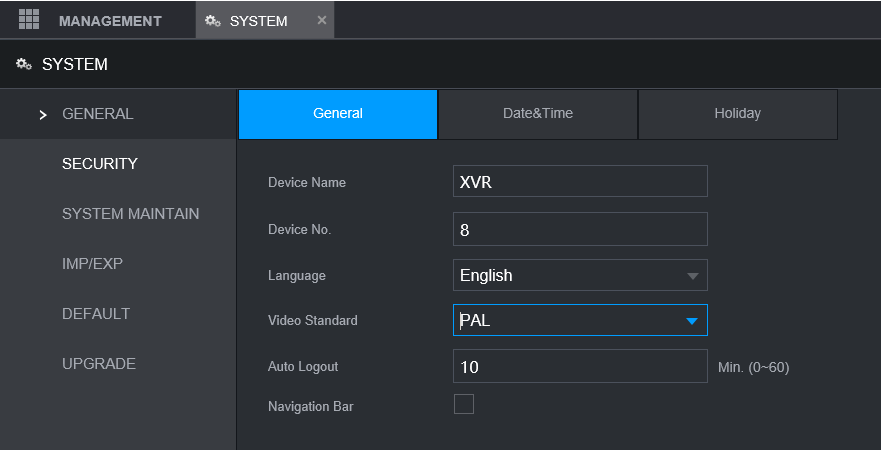

## Installation and configuration

### General info

- stock firmware
- access: http://192.168.1.101 (Edge in IE mode)

### Config

#### Camera

#### Network

- disable everything else:
  - Wi-Fi
  - 3G/4G
  - PPPoE
  - DDNS
  - EMAIL
  - UPnP
  - SNMP
  - MULTICAST

#### Storage

- SFTP is not working for some reason --> use FTP
- https://dahuawiki.com/FTP/FTP_Setup_Core_FTP_Server
- https://dahuawiki.com/FTP/FTP_Snapshot_Setup

#### System

note: export configuration to file

### Other

#### Convert .dav to .mp4

- `ffmpeg -y -i video.dav -vcodec libx265 -movflags +faststart video.mp4`
- https://ipcamtalk.com/threads/recommend-dav-to-mp4-converter-please.30193/
- https://trac.ffmpeg.org/wiki/Encode/H.265
- https://ffmpeg.org/download.html#build-windows
- https://www.gyan.dev/ffmpeg/builds/
